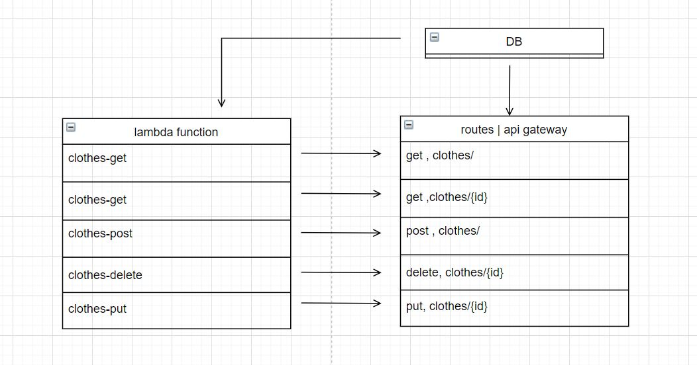

# serverlessAPI

this project is a practice prioject for lab 18 of 401 course at asac

**Author** : hiba salem

- ### description

---

- ### [pull request](https://github.com/hibasalem/serverlessAPI/pull/1)

- ### deploy links

  - [root URL](https://tpf6kd1qzb.execute-api.us-east-1.amazonaws.com/clothes)
    `http://cloudserver-env.eba-eiv77qmg.us-east-1.elasticbeanstalk.com/`

  - 

---

- ### end points

  - `/clothes`
  - get

  ```
    [
       {
        "id": "819a8ef6-ceee-4252-bfab-6de4a94a3c1a",
        "name": "any",
        "type": "any"
       }
    ]

  ```

  - `/clothes/${id}`
  - get

  ```
       {
        "id": "819a8ef6-ceee-4252-bfab-6de4a94a3c1a",
        "name": "any",
        "type": "any"
       }

  ```

  - `/clothes`
  - post

  - send in the body `{"name": "any" , "type":"any"}`

  ```
       {
        "id": "819a8ef6-ceee-4252-bfab-6de4a94a3c1a",
        "name": "any",
        "type": "any"
       }

  ```

  - `clothes/${id}`
  - put
  - send in the body `{"name": "any" , "type":"any"}`

  ```
    {
       {
        "id": "819a8ef6-ceee-4252-bfab-6de4a94a3c1a",
        "name": "any",
        "type": "any"
       }
    }

  ```

  - `clothes/${id}`
  - delete

  ```
  {}

  ```

---
